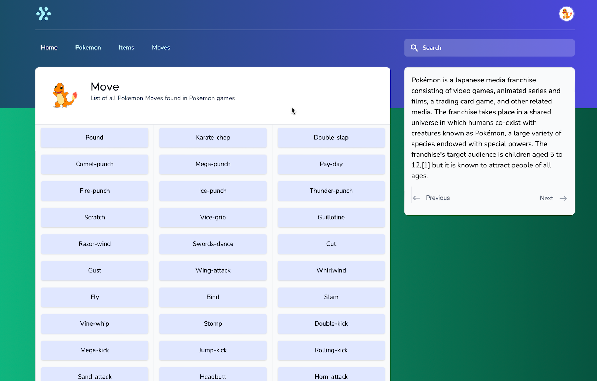
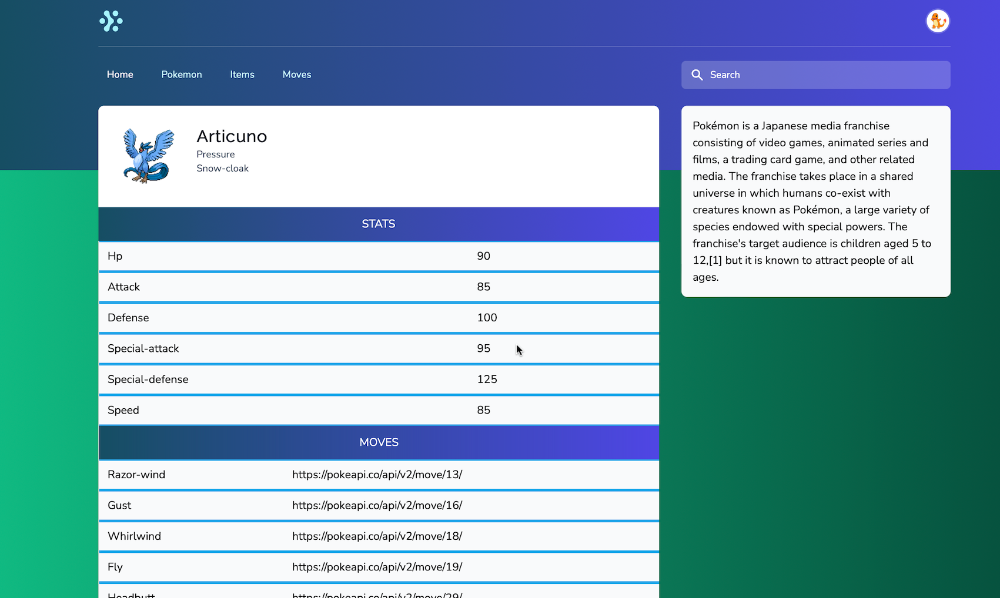
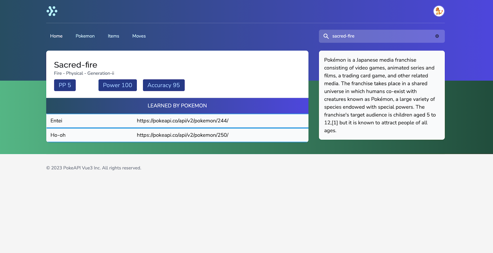

<!-- ABOUT THE PROJECT -->
## About The Project

I created this project to enhance my existing knowledge in Vue 3 especially in using Composition API and Pinia data store. I used this open API which has tons of pokemon data <a href="https://pokeapi.co">https://pokeapi.co</a>

I also used Headless-UI library to add dynamic components like dropdown in this project. For browser-based testing I included Cypress library into this project.

<p align="right">(<a href="#readme-top">back to top</a>)</p>

### Built With

The project is build using Vue 3 with Vite as bundler. This uses Tailwind CSS for UI and Cypress for testing. Data is coming from PokeAPI.

### Project Screenshots

This section would show the screenshots for this project. There are currently 3 images for this project inside the screenshots folder. The screenshots show the Move list page, Pokemon detail page and Move detail page.







<!-- GETTING STARTED -->
## Getting Started

This is a Vue 3 project powered by Vite. You need to have Node and npm/yarn installed on your system in order to run this project. 

### Prerequisites

Node and NPM. Some knowledge of Javascript and Vue JS would greatly help.

### Installation

Simple steps to set this thing on your system.

1. Clone the repo
   ```sh
   git clone https://github.com/Apfirebolt/vue3_pokedex.git
   ```
2. Install NPM packages
   ```sh
   npm install
   ```
3. Run the project in development mode on your system
   ```sh
   npm run dev
   ```
4. Create a production build using Vite
   ```sh
   npm run build
   ```

<p align="right">(<a href="#readme-top">back to top</a>)</p>


<!-- CONTRIBUTING -->
## Contributing

Contributions are what make the open source community such an amazing place to learn, inspire, and create. Any contributions you make are **greatly appreciated**.

If you have a suggestion that would make this better, please fork the repo and create a pull request. You can also simply open an issue with the tag "enhancement".
Don't forget to give the project a star! Thanks again!

1. Fork the Project
2. Create your Feature Branch (`git checkout -b feature/AmazingFeature`)
3. Commit your Changes (`git commit -m 'Add some AmazingFeature'`)
4. Push to the Branch (`git push origin feature/AmazingFeature`)
5. Open a Pull Request

There are a lot of API end-points like contests, areas and much more from the PokeAPI open API. There could well be separate pages for these data from the pokemon games.

<p align="right">(<a href="#readme-top">back to top</a>)</p>


<!-- LICENSE -->
## License

Distributed under the MIT License. See `LICENSE.md` for more information.

<p align="right">(<a href="#readme-top">back to top</a>)</p>

